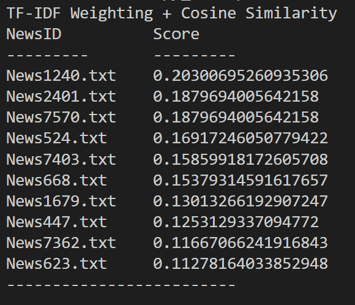
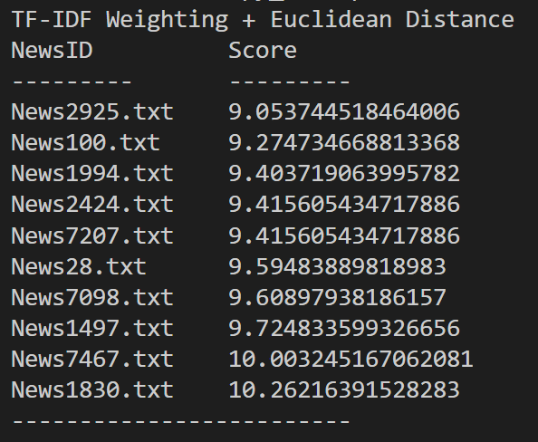
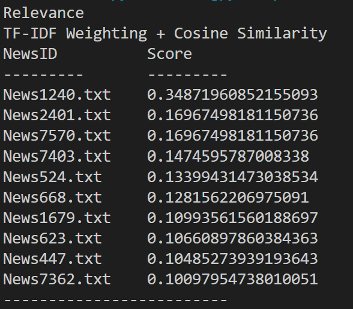
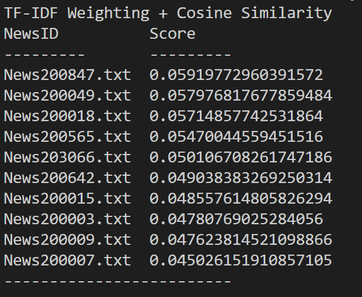
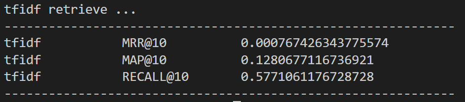

# VSM Project 1

## Example output







## Function Call Example

**Set stopwords.txt path** ```in Parser.py```

```python
self.stopwords = open('C:\\Users\\USER\\py_workspace\\wsm-codes\\english.stop', 'r').read().split()
```

##### 1-1. Term Frequency (TF) Weighting + Cosine Similarity(Problem 1)

- Set eight thousand documents path in ```main.py```

    ```python
    eightThousandsPath = "C:\\Users\\USER\\py_workspace\\wsm-codes\\EnglishNews"
    ```

- ```query = 'your_query_string'``` in ```main.py```

    ```python
    query = "Youtube Taiwan COVID-19"
    ```

- Set similarity mode in ```main.py```
  - ```'cs'``` for cosine similarity, ```'eu'``` for euclidean distance

- ```feedBack_mode = False```

    ```python
    relevanceScore(eightThousandsPath, 'cs', query, feedBack_mode = False, chineseMode = False)
    ```

##### 1-2. Term Frequency (TF) Weighting + Euclidean Distance(Problem 1-2)

in ```main.py```

```python
relevanceScore(eightThousandsPath, 'eu', query, feedBack_mode = False, chineseMode = False)
 ```

##### 2. tf-idf with feedback

```feedBack_mode = True```  in  ```main.py```

```python
relevanceScore(eightThousandsPath, 'cs', query, feedBack_mode = True, chineseMode = False)
 ```

##### 3. Term Frequency (TF) Weighting + Cosine Similarity with Chinese datasets

in ```main.py```

1. ```chinesePath``` path to chinese news documents
2. ```chineseQuery``` chinese query string
3. ```chineseMode = True```

    ```python
    chinesePath = "C:\\Users\\USER\\py_workspace\\wsm-codes\\ChineseNews"
    chineseQuery = '烏克蘭 大選'
    relevanceScore(chinesePath, 'cs', chineseQuery, feedBack_mode = False, chineseMode = True)
    ```

##### 4. Evaluation: MRR@10, MAP@10, RECALL@10

```in main.py```
```evaluation()```
